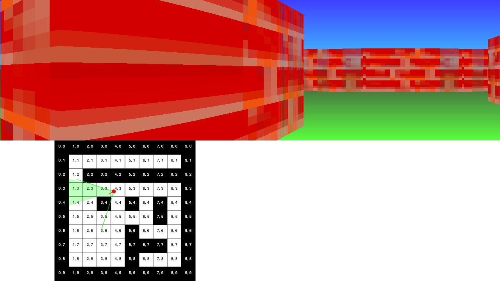
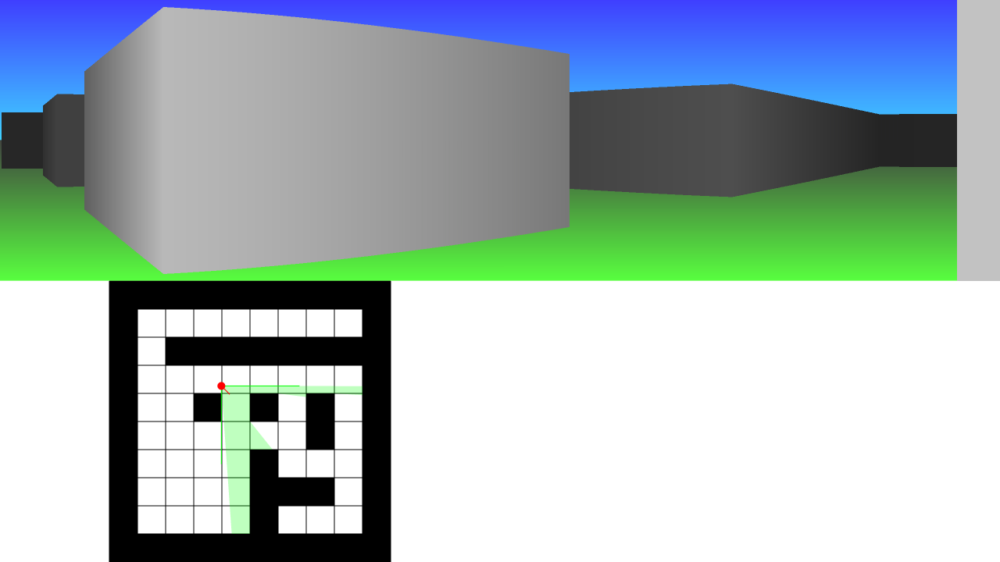

# Typescript Wolfenstein 3D style raycasting

I was inspired by listening to John Carmack, so I wanted to write my own interactive ray casting renderer in Typescript.

You can view the live demo on my [website](https://igniparoustempest.github.io/raycast-renderer/).

## Pictures

### Textured

### Shaded

